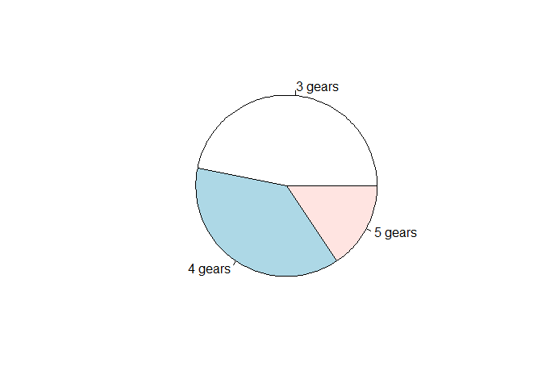
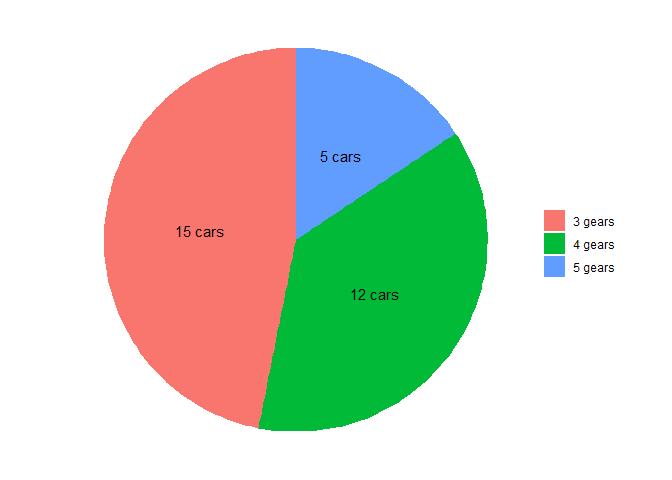
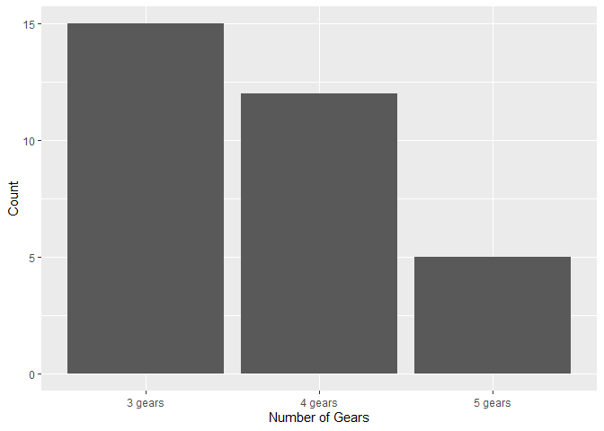

## 1.1 Analyzing Categorical Data

### c. Pie Charts & Bar Charts

Download the .rmd file, which you can run yourself in your installation
of R, [here](1.1.c.rmd).

In this tutorial, we’re going to look at two ways of visually
representing data in R – through a **pie chart** and **bar chart**.

First, we’ll load up a dataset that’s actually built right into R’s
platform – `mtcars`.

``` r
#importing the data
attach(mtcars)
```

Let’s check out what `mtcars` includes:

``` r
summary(mtcars)
```

    ##       mpg             cyl             disp             hp       
    ##  Min.   :10.40   Min.   :4.000   Min.   : 71.1   Min.   : 52.0  
    ##  1st Qu.:15.43   1st Qu.:4.000   1st Qu.:120.8   1st Qu.: 96.5  
    ##  Median :19.20   Median :6.000   Median :196.3   Median :123.0  
    ##  Mean   :20.09   Mean   :6.188   Mean   :230.7   Mean   :146.7  
    ##  3rd Qu.:22.80   3rd Qu.:8.000   3rd Qu.:326.0   3rd Qu.:180.0  
    ##  Max.   :33.90   Max.   :8.000   Max.   :472.0   Max.   :335.0  
    ##       drat             wt             qsec             vs        
    ##  Min.   :2.760   Min.   :1.513   Min.   :14.50   Min.   :0.0000  
    ##  1st Qu.:3.080   1st Qu.:2.581   1st Qu.:16.89   1st Qu.:0.0000  
    ##  Median :3.695   Median :3.325   Median :17.71   Median :0.0000  
    ##  Mean   :3.597   Mean   :3.217   Mean   :17.85   Mean   :0.4375  
    ##  3rd Qu.:3.920   3rd Qu.:3.610   3rd Qu.:18.90   3rd Qu.:1.0000  
    ##  Max.   :4.930   Max.   :5.424   Max.   :22.90   Max.   :1.0000  
    ##        am              gear            carb      
    ##  Min.   :0.0000   Min.   :3.000   Min.   :1.000  
    ##  1st Qu.:0.0000   1st Qu.:3.000   1st Qu.:2.000  
    ##  Median :0.0000   Median :4.000   Median :2.000  
    ##  Mean   :0.4062   Mean   :3.688   Mean   :2.812  
    ##  3rd Qu.:1.0000   3rd Qu.:4.000   3rd Qu.:4.000  
    ##  Max.   :1.0000   Max.   :5.000   Max.   :8.000

As you can see, this dataset has a number of variables that can be
measured on cars. The one we’ll focus on first is `gear`, which tells us
the number of gears each car in the dataset has. Just to get a handle on
what we can expect, let’s look at a frequency table of `gear` using the
`$` operator to tell R that we want to look within the `mtcars` dataset:

``` r
table(mtcars$gear)
```

    ## 
    ##  3  4  5 
    ## 15 12  5

This (very basic) table tells us that there are 15 cars with 3 gears, 12
with 4 gears, and 5 with 5 gears in our dataset.

First, we’ll create a **pie chart** to summarize this distribution:

``` r
#pie chart with the pie() function
slices = c(15, 12, 5)
labels.pie = c("3 gears", "4 gears", "5 gears")
pie(slices, 
    labels=labels.pie)
```



This does the trick!

If you want a slightly better looking pie chart, we can create one using
the `ggplot2` package. First, install the package using the following
chunk. I have commented out (with a `#`) the line that will install the
package for you, so just add it back in by removing the `#` and run the
chunk!

``` r
#install.packages("ggplot2")
```

Now, we can use the `ggplot2` package to create a slightly nicer pie
chart. This function has a bunch of arguments, which I’ll break down for
you.

``` r
#ggplot2 pie chart
library(ggplot2)
```

    ## Warning: package 'ggplot2' was built under R version 4.1.3

    ## 
    ## Attaching package: 'ggplot2'

    ## The following object is masked from 'mtcars':
    ## 
    ##     mpg

``` r
pieframe = data.frame(slices, labels.pie)
ggplot(pieframe, aes(x="", y=slices, fill=labels.pie)) +
  geom_bar(stat="identity", width=1) +
  coord_polar("y", start=0) + 
  theme_void() + 
  geom_text(aes(label = paste0(slices, " cars")), position = position_stack(vjust=0.5)) +
  labs(x = NULL, y = NULL, fill = NULL)
```

 First,
because the `ggplot` function expects a dataframe input, we had to
create a dataframe (combining the variables `slices` and `labels.pie`
that we created in our earlier pie chart endeavor) called `pieframe`.

We pass `ggplot` the `pieframe` data, then identify some “aesthetics”
through `aes()` that we want to include in the plot: namely, `slices`
and `labels.pie`. A full explanation of how `ggplot` uses aesthetics is
beyond the scope of what we need to do here, although we may touch on
this function again throughout the course.

We then tell `ggplot` to make us a `geom_bar()`. (Wait, what?? We’re
telling it to make us a bar chart?) Sure – but we’re going to input the
heights of the bars in polar fashion (`coord_polar("y", start=0)`) so
they tell `ggplot` how much to rotate around a central axis instead of
how tall to make the bars. **This function isn’t really meant to create
a pie chart, but we are able to convince it to do it for us with this
input!**

The rest of our arguments are just for making a pretty pie chart.
`theme_void()` gets rid of some messy background graphics that `ggplot`
includes by default, and `geom_text()` inputs the labels into each
slice. Again, because we won’t be using `ggplot` all the time, I’m
intentionally glossing over some of the details here.

Similarly, we can craft a **bar chart** to present the data:

``` r
barplot(slices,
        names.arg=labels.pie,
        xlab = "Number of Gears",
        ylab = "Count")
```


Alternately, we can use `ggplot` again to create a bar chart:

``` r
#ggplot2 bar chart
library(ggplot2)
ggplot(data=pieframe, aes(x=labels.pie, y=slices)) + 
  geom_bar(stat="identity") + 
  labs(x="Number of Gears", y="Count")
```



Here, the `ggplot` arguments may be a bit easier to interpret (since we
aren’t trying to convince `geom_bar()` to make us a pie chart this
time!). As you can see, the x-axis shows the categorical variable
`labels.pie` from our `pieframe` data, while the y-axis shows the count
variable `slices`. We then create a `geom_bar()` that takes that
information and crafts a bar chart out of it. We’ve also added `labs()`
to label the axes.
